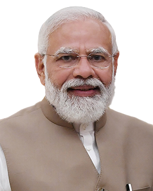

# What's in a name!?

---

## Of the people.

--

## By the people.

--

## For the people.

--

## Of the people.

--

## By the people.

--

## For the people.

--

## Of the people.

--

## By the people.

--

## For the people.

---

# Democracy

---

# Bharat

--

## Bharat (India)

    

--

### The largest democracy in the world!

---

## India: A land of cultural diversity

--

### 121 majorly Spoken Languages

--

### Over 19,500 dialects!

--

### Unity in Diversity:

    <h3 class="text-sm underline italic">Bharat</h1>

---

## Face seem familiar?

    

---

#### Oopsie-Daisy? 
<iconify-icon icon="noto:thinking-face"></iconify-icon>

    

---

### In today's speech... 
I will talk about the recent controversy over the potential renaming of India to Bharat

--

### Bharatiya Janata Party 
- Cultural Nationalism
- National Integration
* Positive Secularism
* Gandhian Socialism

--

### Indian National Congress 
+ Social Equality
- Secularism
* Inclusive Growth

--

### Religious Minorities
+ Religious expression and Freedom

